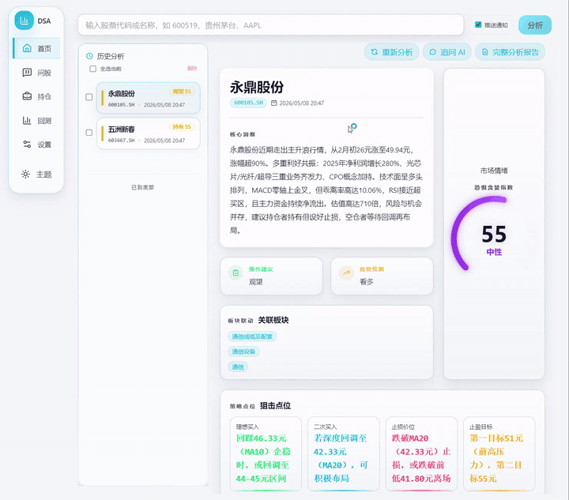

<div align="center">

# 📈 株式インテリジェント分析システム

[](https://github.com/ZhuLinsen/daily_stock_analysis/stargazers)
[](https://github.com/ZhuLinsen/daily_stock_analysis/actions/workflows/ci.yml)
[](https://opensource.org/licenses/MIT)
[](https://www.python.org/downloads/)
[](https://github.com/features/actions)
[](https://hub.docker.com/r/zhulinsen/daily_stock_analysis)

<p align="center">
  <a href="https://trendshift.io/repositories/18527" target="_blank"></a>&nbsp;<a href="https://hellogithub.com/repository/ZhuLinsen/daily_stock_analysis" target="_blank"></a>
</p>

> 🤖 AI 大規模モデルを活用した、A 株／香港株／米国株のウォッチリスト向けインテリジェント分析システム。毎日自動で分析し、「意思決定ダッシュボード」を WeCom／Lark／Telegram／Discord／Slack／メールへ配信します

[**プロダクトプレビュー**](#-プロダクトプレビュー) · [**機能特性**](#-機能特性) · [**クイックスタート**](#-クイックスタート) · [**配信イメージ**](#-配信イメージ) · [**ドキュメントセンター**](INDEX.md) · [**完全ガイド**](full-guide.md)

[简体中文](../README.md) | [English](README_EN.md) | [繁體中文](README_CHT.md) | 日本語

</div>

## 💖 スポンサー (Sponsors)
<div align="center">
  <p align="center">
    <a href="https://open.anspire.cn/?share_code=QFBC0FYC" target="_blank"></a>
    <a href="https://serpapi.com/baidu-search-api?utm_source=github_daily_stock_analysis" target="_blank"></a>
  </p>
</div>


## 🖥️ プロダクトプレビュー

<p align="center">
  
</p>

## ✨ 機能特性

| 能力 | カバー範囲 |
|------|------|
| AI 意思決定レポート | 中核となる結論、スコア、トレンド、売買ポイント、リスク警報、カタリスト、操作チェックリスト |
| マルチマーケットのデータ集約 | A 株、香港株、米国株、ETF；相場、ローソク足、テクニカル指標、資金フロー、チップ分布、ニュース、適時開示、ファンダメンタルズ |
| Web／デスクトップワークスペース | 手動分析、タスク進捗、過去レポート、完全な Markdown、バックテスト、保有銘柄、設定管理、ライト／ダークテーマ |
| Agent 戦略による銘柄相談 | 複数ラウンドの追問に対応し、移動平均、纏論、波動理論、トレンド、ホットテーマ、イベント、グロース、期待などの 15 種類の組み込み戦略をサポート。Web／Bot／API をカバー |
| スマートインポートと補完 | 画像、CSV／Excel、クリップボードからのインポート；銘柄コード／名称／ピンイン／別名の補完 |
| 自動化と配信 | GitHub Actions、Docker、ローカルの定時タスク、FastAPI サービス、および WeCom／Lark／Telegram／Discord／Slack／メールへの配信 |

> 機能の詳細、フィールド契約、ファンダメンタルズ P0 のタイムアウトセマンティクス、取引規律、データソースの優先順位、Web／API の挙動については [完全な設定・デプロイガイド](full-guide.md) を参照してください。

### 技術スタックとデータソース

| 種類 | 対応 |
|------|------|
| AI モデル | [Anspire](https://open.anspire.cn/?share_code=QFBC0FYC)、[AIHubMix](https://aihubmix.com/?aff=CfMq)、Gemini、OpenAI 互換、DeepSeek、通義千問、Claude、Ollama ローカルモデルなど |
| 相場データ | [TickFlow](https://tickflow.org/auth/register?ref=WDSGSPS5XC)、AkShare、Tushare、Pytdx、Baostock、YFinance、Longbridge |
| ニュース検索 | [Anspire](https://open.anspire.cn/?share_code=QFBC0FYC)、[SerpAPI](https://serpapi.com/baidu-search-api?utm_source=github_daily_stock_analysis)、[Tavily](https://tavily.com/)、[Bocha](https://open.bocha.cn/)、[Brave](https://brave.com/search/api/)、[MiniMax](https://platform.minimaxi.com/)、SearXNG |
| ソーシャルセンチメント | [Stock Sentiment API](https://api.adanos.org/docs)（Reddit／X／Polymarket、米国株のみ、オプション） |

> 完全なルールは [データソース設定](full-guide.md#数据源配置) を参照してください。

## 🚀 クイックスタート

### 方法 1：GitHub Actions（推奨）

> 5 分でデプロイ完了、コストゼロ、サーバー不要。


#### 1. 本リポジトリを Fork する

右上の `Fork` ボタンをクリック（ついでに Star⭐ で応援していただけると嬉しいです）

#### 2. Secrets を設定する

`Settings` → `Secrets and variables` → `Actions` → `New repository secret`

**AI モデル設定（少なくとも 1 つ設定）**

デフォルトではまずモデルプロバイダーを 1 つ選び、API Key を入力します。複数モデル、画像認識、ローカルモデル、または高度なルーティングが必要な場合は [LLM 設定ガイド](LLM_CONFIG_GUIDE.md) を参照してください。

| Secret 名 | 説明 | 必須 |
|------------|------|:----:|
| `ANSPIRE_API_KEYS` | [Anspire](https://open.anspire.cn/?share_code=QFBC0FYC) API Key。1 つの Key でグローバルの人気モデルとウェブ検索を同時に利用でき、VPN 不要、無料枠付き | **推奨** |
| `AIHUBMIX_KEY` | [AIHubMix](https://aihubmix.com/?aff=CfMq) API Key。1 つの Key で全シリーズのモデルを切り替えて利用でき、VPN 不要、本プロジェクトでは 10% 割引 | **推奨** |
| `GEMINI_API_KEY` | Google Gemini API Key | オプション |
| `ANTHROPIC_API_KEY` | Anthropic Claude API Key | オプション |
| `OPENAI_API_KEY` | OpenAI 互換 API Key（DeepSeek、通義千問などをサポート） | オプション |
| `OPENAI_BASE_URL` / `OPENAI_MODEL` | OpenAI 互換サービスを使用する場合に入力 | オプション |

> Ollama はローカル／Docker デプロイにより適しており、GitHub Actions ではクラウド API の利用を推奨します。

**通知チャネル設定（少なくとも 1 つ設定）**

| Secret 名 | 説明 |
|------------|------|
| `WECHAT_WEBHOOK_URL` | WeCom ボット |
| `FEISHU_WEBHOOK_URL` | Lark ボット |
| `TELEGRAM_BOT_TOKEN` + `TELEGRAM_CHAT_ID` | Telegram |
| `DISCORD_WEBHOOK_URL` | Discord Webhook |
| `SLACK_BOT_TOKEN` + `SLACK_CHANNEL_ID` | Slack Bot |
| `EMAIL_SENDER` + `EMAIL_PASSWORD` | メール配信 |

より多くのチャネル、署名検証、グループ別メール、Markdown の画像変換などの設定は [通知チャネルの詳細設定](full-guide.md#通知渠道详细配置) を参照してください。

**ウォッチリスト設定（必須）**

| Secret 名 | 説明 | 必須 |
|------------|------|:----:|
| `STOCK_LIST` | ウォッチリストのコード（例：`600519,hk00700,AAPL,TSLA`） | ✅ |

**ニュースソース設定（推奨）**

ニュースソースはセンチメント、適時開示、イベント、カタリストの品質に大きく影響します。少なくとも 1 つの検索サービスを設定することを推奨します。

| Secret 名 | 説明 | 必須 |
|------------|------|:----:|
| `ANSPIRE_API_KEYS` | [Anspire AI Search](https://aisearch.anspire.cn/)：中国語コンテンツに特化して最適化されており、A 株のニュースやセンチメント検索に適しています。同じ Key を Anspire の大規模モデルにも再利用可能 | **推奨** |
| `SERPAPI_API_KEYS` | [SerpAPI](https://serpapi.com/baidu-search-api?utm_source=github_daily_stock_analysis)：検索エンジン結果の補強。リアルタイムの金融ニュースに適しています | **推奨** |
| `TAVILY_API_KEYS` | [Tavily](https://tavily.com/)：汎用のニュース検索 API | オプション |
| `BOCHA_API_KEYS` | [Bocha 検索](https://open.bocha.cn/)：中国語検索に最適化、AI 要約をサポート | オプション |
| `BRAVE_API_KEYS` | [Brave Search](https://brave.com/search/api/)：プライバシー優先、米国株情報の補強 | オプション |
| `MINIMAX_API_KEYS` | [MiniMax](https://platform.minimaxi.com/)：構造化された検索結果 | オプション |
| `SEARXNG_BASE_URLS` | SearXNG セルフホストインスタンス：クォータ制限のないフォールバック、プライベートデプロイに適しています | オプション |

より多くの検索ソース、ソーシャルセンチメント、フォールバックルールは [検索サービス設定](full-guide.md#搜索服务配置) を参照してください。

#### 3. Actions を有効化する

`Actions` タブ → `I understand my workflows, go ahead and enable them`

#### 4. 手動テスト

`Actions` → `Daily Stock Analysis` → `Run workflow` → `Run workflow`

#### 完了

デフォルトでは毎**営業日 18:00（北京時間）**に自動実行され、手動でのトリガーも可能です。デフォルトでは非取引日（A／H／US の祝日を含む）は実行されません。強制実行、取引日チェック、チェックポイントからの再開などのルールは [完全ガイド](full-guide.md#定时任务配置) を参照してください。

### 方法 2：ローカル実行／Docker デプロイ

```bash
# プロジェクトをクローン
git clone https://github.com/ZhuLinsen/daily_stock_analysis.git && cd daily_stock_analysis

# 依存関係をインストール
pip install -r requirements.txt

# 環境変数を設定
cp .env.example .env && vim .env

# 分析を実行
python main.py
```

よく使うコマンド：

```bash
python main.py --debug
python main.py --dry-run
python main.py --stocks 600519,hk00700,AAPL
python main.py --market-review
python main.py --schedule
python main.py --serve-only
```

> Docker デプロイ、定時タスク、クラウドサーバーへのアクセスは [完全ガイド](full-guide.md) を、デスクトップクライアントのパッケージングは [デスクトップ版パッケージング説明](desktop-package.md) を参照してください。

## 📱 配信イメージ

### 意思決定ダッシュボード
```
🎯 2026-02-08 意思決定ダッシュボード
合計 3 銘柄を分析 | 🟢買い:0 🟡様子見:2 🔴売り:1

📊 分析結果サマリー
⚪ 中鎢高新(000657): 様子見 | スコア 65 | 強気
⚪ 永鼎股份(600105): 様子見 | スコア 48 | もみ合い
🟡 新莱応材(300260): 売り | スコア 35 | 弱気

⚪ 中鎢高新 (000657)
📰 重要情報クイックビュー
💭 センチメント: 市場はその AI 属性と高い業績成長に注目しており、センチメントはやや前向き。ただし、短期の利益確定売りと主力資金の流出圧力を消化する必要があります。
📊 業績予想: センチメント情報に基づくと、当社の 2025 年第 3 四半期までの業績は前年同期比で大幅に成長しており、ファンダメンタルズは堅調で株価を下支えしています。

🚨 リスク警報:

リスク 1：2 月 5 日に主力資金が 3.63 億元を大幅に純売却。短期の売り圧力に警戒が必要です。
リスク 2：チップ集中度が 35.15% に達しており、チップが分散していることを示します。買い上げの抵抗が比較的大きい可能性があります。
リスク 3：センチメント内で当社の過去の違反記録や再編関連のリスク警告に言及があり、注視が必要です。
✨ ポジティブなカタリスト:

ポジティブ 1：当社は市場で AI サーバー HDI の中核サプライヤーと位置づけられており、AI 産業の発展の恩恵を受けます。
ポジティブ 2：2025 年第 3 四半期までの非経常利益を除く純利益が前年同期比 407.52% 急増し、業績は好調です。
📢 最新動向: 【最新情報】センチメントによると、当社は AI PCB マイクロドリル分野のリーダーであり、世界トップクラスの PCB／基板メーカーと深く結びついています。2 月 5 日に主力資金が 3.63 億元を純売却しており、今後の資金フローに注目が必要です。

---
生成時刻: 18:00
```

### 大引け振り返り
```
🎯 2026-01-10 大引け振り返り

📊 主要指数
- 上海総合指数: 3250.12 (🟢+0.85%)
- 深セン成分指数: 10521.36 (🟢+1.02%)
- 創業板指数: 2156.78 (🟢+1.35%)

📈 マーケット概況
上昇: 3920 | 下落: 1349 | ストップ高: 155 | ストップ安: 3

🔥 セクターパフォーマンス
上昇率上位: インターネットサービス、文化メディア、希少金属
下落率上位: 保険、航空・空港、太陽光発電設備
```

## ⚙️ 設定説明

完全な環境変数、モデルチャネル、通知チャネル、データソースの優先順位、取引規律、ファンダメンタルズ P0 のセマンティクス、デプロイ説明については [完全な設定ガイド](full-guide.md) を参照してください。

## 🖥️ Web インターフェース

Web ワークスペースは、設定管理、タスク監視、手動分析、過去レポート、完全な Markdown レポート、Agent 銘柄相談、バックテスト、保有銘柄管理、スマートインポート、ライト／ダークテーマを提供します。起動方法：

```bash
python main.py --webui
python main.py --webui-only
```

`http://127.0.0.1:8000` にアクセスして利用できます。認証、スマートインポート、検索補完、過去レポートのコピー、クラウドサーバーへのアクセスなどの詳細は [ローカル WebUI 管理画面](full-guide.md#本地-webui-管理界面) を参照してください。

## 🤖 Agent 戦略による銘柄相談

利用可能な任意の AI API Key を設定すると、Web の `/chat` ページで戦略による銘柄相談を利用できます。明示的に無効化したい場合は `AGENT_MODE=false` を設定してください。

- 移動平均ゴールデンクロス、纏論、波動理論、上昇トレンド、ホットテーマ、イベントドリブン、グロース品質、期待の再評価などの組み込み戦略をサポート
- リアルタイム相場、ローソク足、テクニカル指標、ニュース、リスク情報の呼び出しをサポート
- 複数ラウンドの追問、セッションのエクスポート、通知チャネルへの送信、バックグラウンド実行をサポート
- カスタム戦略ファイルとマルチ Agent オーケストレーション（実験的）をサポート

> Agent の具体的なパラメーター、`skill` の命名互換性、マルチ Agent モード、予算ガードレールについては [完全ガイド](full-guide.md#本地-webui-管理界面) と [LLM 設定ガイド](LLM_CONFIG_GUIDE.md) を参照してください。

## 🧩 関連プロジェクト (Related Projects)

> DSA は日次の分析レポートに注力しています。以下の 2 つの姉妹プロジェクトは、それぞれ銘柄選定、戦略検証、戦略進化をカバーしており、必要に応じて拡張利用するのに適しています。これらは現在独立して保守されており、今後は DSA との候補銘柄インポート、バックテスト検証、レポート連携を優先的に探求していきます。

| プロジェクト | 位置づけ |
|------|------|
| [AlphaSift](https://github.com/ZhuLinsen/alphasift) | マルチファクターの銘柄選定と全市場スキャン。銘柄プールから候補銘柄を抽出するために使用 |
| [AlphaEvo](https://github.com/ZhuLinsen/alphaevo) | 戦略のバックテストと自己進化。戦略ルールを検証し、反復によって戦略パラメーターと組み合わせを探求するために使用 |

## 📬 連絡と協業

<table>
  <tr>
    <td width="92" valign="top"><strong>協業メール</strong></td>
    <td valign="top">
      <a href="mailto:zhuls345@gmail.com">zhuls345@gmail.com</a><br>
      プロジェクトのご相談、デプロイ支援、機能拡張
    </td>
    <td align="center" rowspan="3" valign="middle" width="148">
      <a href="http://xhslink.com/m/tU520DWCKT" target="_blank"></a><br>
      <sub>スキャンして Xiaohongshu をフォロー</sub>
    </td>
  </tr>
  <tr>
    <td width="92" valign="top"><strong>Xiaohongshu</strong></td>
    <td valign="top"><a href="http://xhslink.com/m/tU520DWCKT">Xiaohongshu でフォローしてください</a></td>
  </tr>
  <tr>
    <td width="92" valign="top"><strong>問題のフィードバック</strong></td>
    <td valign="top"><a href="https://github.com/ZhuLinsen/daily_stock_analysis/issues">Issue を提出</a></td>
  </tr>
</table>

## 📄 ライセンス

[MIT License](LICENSE) © 2026 ZhuLinsen

二次開発や引用の際は、本リポジトリを出典として明記していただけると幸いです。プロジェクトの継続的な保守へのご支援に感謝します。

## ⚠️ 免責事項

本プロジェクトは学習・研究目的のみに使用され、いかなる投資助言も構成しません。株式市場にはリスクがあり、投資は慎重に行ってください。作者は本プロジェクトの使用により生じたいかなる損失についても責任を負いません。
