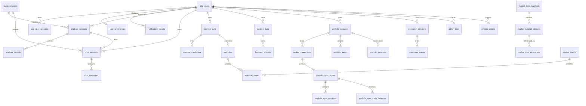

# WolfyStock PostgreSQL Baseline Design

Companion artifacts:

- [`postgresql-baseline-plan.md`](./postgresql-baseline-plan.md)
- [`postgresql-baseline-v1.sql`](./postgresql-baseline-v1.sql)

## Phase Scope

This phase defines the database baseline required to move WolfyStock toward a shared backend and shared database for:

- website as the primary product surface
- future mini-program as a secondary entry point
- PostgreSQL as the system-of-record for business data and hot metadata
- Parquet plus local/NAS as the primary store for bulk historical market data

This phase does **not** implement a full migration. It does **not** move bulk historical OHLCV into PostgreSQL. It does **not** change current runtime storage behavior.

## Hard Architecture Decisions Preserved

- PostgreSQL is the target system-of-record for:
  - users and authenticated sessions
  - guest-session isolation
  - user preferences and notification targets
  - analysis, chat, scanner, backtest, and portfolio business records
  - admin and system config and logs
  - provider config
  - symbol master and market-data manifests / dataset-version metadata
- Parquet plus local/NAS remains the target primary store for:
  - long-history OHLCV bars
  - long-history benchmark series
  - bulk historical market datasets used by scanner and backtest
  - local-first / NAS-synced historical inputs

## Current-State Storage Audit

### 1. Auth / sessions / users

- Persisted:
  - `app_users`
  - `app_user_sessions`
- Current storage:
  - SQLite via `src/storage.py`
  - bootstrap compatibility files in `src/auth.py`:
    - `.admin_password_hash`
    - `.session_secret`
- Current source-of-record:
  - authenticated runtime identity already resolves from `app_users` plus `app_user_sessions`
  - bootstrap admin credential still has dual semantics because the file-backed password is mirrored into `app_users`
- Transient / derived:
  - signed cookie payload
  - `request.state.current_user`
- Ownership boundary:
  - admin is a role on the same `app_users` identity model, not a separate auth universe
- Evidence:
  - `src/storage.py`
  - `src/auth.py`
  - `api/deps.py`
  - `api/v1/endpoints/auth.py`
  - `docs/architecture/multi-user-foundation-phase2.md`
- Storage inconsistencies:
  - bootstrap admin password still has file-backed compatibility semantics
  - session truth is split between signed cookie and session row

### 2. Guest sessions

- Persisted:
  - no first-class guest row today
- Current storage:
  - browser cookie `wolfystock_guest_session`
  - guest query-chain isolation only
- Current source-of-record:
  - cookie value is the only guest identifier
- Transient / derived:
  - `guest:<session_id>:<timestamp>` query ids
  - preview response payload only
- Ownership boundary:
  - guest preview is isolated by cookie and explicitly does not land in `analysis_history`
- Evidence:
  - `api/v1/endpoints/analysis.py`
  - `tests/test_public_analysis_preview_api.py`
  - `docs/full-guide.md`
- Storage inconsistencies:
  - guest isolation exists, but guest session persistence does not
  - there is no durable guest workspace or guest-owned record model yet

### 3. Preferences / notifications

- Persisted:
  - `user_preferences`
  - `notification_preferences_json` inside the same row
- Current storage:
  - SQLite via `src/storage.py`
- Current source-of-record:
  - `user_preferences.notification_preferences_json`
- Transient / derived:
  - delivery availability is derived from `.env` SMTP config plus stored target values
- Ownership boundary:
  - strictly user-owned
- Evidence:
  - `src/storage.py`
  - `api/v1/endpoints/auth.py`
  - `src/core/pipeline.py`
- Storage inconsistencies:
  - UI preferences and notification targets are coupled in one table
  - notification targets are JSON, not first-class rows
  - default email semantics are behavior, not schema

### 4. Analysis workspace

- Persisted:
  - `analysis_history`
  - `news_intel`
  - `fundamental_snapshot`
  - `execution_log_sessions`
  - `execution_log_events`
- Current storage:
  - SQLite via `src/storage.py`
- Current source-of-record:
  - `analysis_history` is the saved report history for registered users
  - `news_intel` and `fundamental_snapshot` are append-only supporting snapshots keyed by `query_id`
- Transient / derived:
  - task queue task state is in memory
  - progress updates and SSE events are in memory
  - some exported report files are file outputs, not record truth
- Ownership boundary:
  - user-owned via `owner_id`
  - guest preview bypasses persistence
- Evidence:
  - `src/storage.py`
  - `src/services/analysis_service.py`
  - `src/services/task_queue.py`
  - `src/services/history_service.py`
  - `src/core/pipeline.py`
- Storage inconsistencies:
  - there is no first-class analysis-session/workspace table
  - `analysis_history` mixes per-run snapshot fields with user-facing history concerns
  - reproducibility metadata for the exact market dataset version is missing

### 5. Chat / ask-stock

- Persisted:
  - `conversation_sessions`
  - `conversation_messages`
- Current storage:
  - SQLite via `src/storage.py`
- Current source-of-record:
  - `conversation_sessions` plus `conversation_messages`
- Transient / derived:
  - `ConversationManager` keeps TTL-bound in-memory session objects and context
  - only message history is persisted
- Ownership boundary:
  - user-owned via `owner_id`
  - cross-owner access is blocked in the repository layer
- Evidence:
  - `src/agent/conversation.py`
  - `src/storage.py`
  - `docs/architecture/multi-user-foundation-phase3.md`
- Storage inconsistencies:
  - current table names are conversation-oriented, while the product surface is chat-oriented
  - session context is partially transient and partially implicit

### 6. Scanner

- Persisted:
  - `market_scanner_runs`
  - `market_scanner_candidates`
- Current storage:
  - SQLite via `src/storage.py`
  - local universe cache CSV via `SCANNER_LOCAL_UNIVERSE_PATH`
- Current source-of-record:
  - scanner run and candidate rows are the business record
  - daily watchlist semantics are derived from run metadata
- Transient / derived:
  - Markdown watchlist export files
  - comparison-to-previous watchlist view
  - review and follow-through metrics derived from `stock_daily`
- Ownership boundary:
  - manual runs are user-owned
  - scheduled/operator runs are system-scoped
- Evidence:
  - `src/services/market_scanner_service.py`
  - `src/services/market_scanner_ops_service.py`
  - `src/repositories/scanner_repo.py`
  - `api/v1/endpoints/scanner.py`
  - `docs/market-scanner.md`
- Storage inconsistencies:
  - `watchlist_date`, `trigger_mode`, `request_source`, and notification state live in `summary_json` / `diagnostics_json`, not first-class columns or tables
  - there is no separate `watchlists` entity
  - dataset-version provenance is missing even though scanner behavior depends on local cache / DB / parquet / provider fallback

### 7. Backtest

- Persisted:
  - standard evaluation:
    - `backtest_runs`
    - `backtest_results`
    - `backtest_summaries`
  - deterministic/rule backtest:
    - `rule_backtest_runs`
    - `rule_backtest_trades`
- Current storage:
  - SQLite via `src/storage.py`
  - execution-trace export files as optional derived artifacts
- Current source-of-record:
  - standard evaluation uses `backtest_*` rows
  - deterministic run truth is split across scalar columns plus `summary_json`, `parsed_strategy_json`, and `equity_curve_json`
- Transient / derived:
  - exported CSV / JSON execution traces
  - some replay views rebuilt from stored audit rows
- Ownership boundary:
  - user-owned via `owner_id`
- Evidence:
  - `src/services/backtest_service.py`
  - `src/services/rule_backtest_service.py`
  - `api/v1/endpoints/backtest.py`
  - `api/v1/schemas/backtest.py`
  - `tests/test_rule_backtest_service.py`
- Storage inconsistencies:
  - deterministic artifacts are heavy JSON blobs on the run row, not first-class artifacts
  - standard evaluation and deterministic backtest use separate storage shapes for closely related product workflows
  - benchmark / comparison / audit provenance exists, but dataset-version provenance does not

### 8. Portfolio / broker sync

- Persisted:
  - `portfolio_accounts`
  - `portfolio_broker_connections`
  - `portfolio_broker_sync_states`
  - `portfolio_broker_sync_positions`
  - `portfolio_broker_sync_cash_balances`
  - `portfolio_trades`
  - `portfolio_cash_ledger`
  - `portfolio_corporate_actions`
  - `portfolio_positions`
  - `portfolio_position_lots`
  - `portfolio_daily_snapshots`
  - `portfolio_fx_rates`
- Current storage:
  - SQLite via `src/storage.py`
- Current source-of-record:
  - ledger-style source events are:
    - `portfolio_trades`
    - `portfolio_cash_ledger`
    - `portfolio_corporate_actions`
  - broker sync tables are overlay snapshots, not ledger truth
- Transient / derived:
  - imported CSV / XML files are not persisted
  - IBKR session token is request-scoped only and intentionally not stored
  - `portfolio_positions`, `portfolio_position_lots`, and `portfolio_daily_snapshots` are replayed / derived materializations
- Ownership boundary:
  - user-owned end to end
- Evidence:
  - `src/services/portfolio_service.py`
  - `src/repositories/portfolio_repo.py`
  - `src/services/portfolio_import_service.py`
  - `src/services/portfolio_ibkr_sync_service.py`
  - `api/v1/endpoints/portfolio.py`
- Storage inconsistencies:
  - source ledger and derived materializations are all first-class tables without an explicit semantic boundary in schema
  - broker sync overlay and source ledger are adjacent but conceptually different data classes

### 9. Admin / system settings

- Persisted:
  - `.env`
- Current storage:
  - file-based config via `src/core/config_manager.py`
- Current source-of-record:
  - `.env`
- Transient / derived:
  - runtime singleton caches
  - loaded config object in memory
- Ownership boundary:
  - global system scope, admin-only mutation
- Evidence:
  - `src/core/config_manager.py`
  - `src/services/system_config_service.py`
  - `api/v1/endpoints/system_config.py`
- Storage inconsistencies:
  - target architecture wants PostgreSQL-backed `system_configs`
  - current runtime still depends on file-based config mutation and reload

### 10. Provider / data-source config

- Persisted:
  - `.env`
- Current storage:
  - file-based config
- Current source-of-record:
  - `.env`
- Transient / derived:
  - normalized credential bundles in memory
- Ownership boundary:
  - global system scope
- Evidence:
  - `data_provider/provider_credentials.py`
  - `src/services/system_config_service.py`
  - `src/core/config_registry.py`
- Storage inconsistencies:
  - provider config is not first-class data yet
  - secrets and non-secret routing config are mixed in one flat `.env`

### 11. Admin logs / system actions

- Persisted:
  - `execution_log_sessions`
  - `execution_log_events`
- Current storage:
  - SQLite via `src/storage.py`
- Current source-of-record:
  - these tables already act as global admin observability
- Transient / derived:
  - filtered list/detail views
- Ownership boundary:
  - global admin-only visibility
- Evidence:
  - `src/services/execution_log_service.py`
  - `api/v1/endpoints/admin_logs.py`
  - `src/services/system_config_service.py`
- Storage inconsistencies:
  - destructive admin actions such as factory reset are embedded as execution-log events, not a dedicated auditable `system_actions` record set

### 12. Market-data manifest / dataset versioning

- Persisted today:
  - `stock_daily` cache in SQLite
  - local parquet files for US history
  - local scanner universe CSV cache
  - static symbol/name maps:
    - `src/data/stock_mapping.py`
    - `apps/dsa-web/public/stocks.index.json`
- Current storage:
  - SQLite, parquet, CSV, static code/data files
- Current source-of-record:
  - bulk history is outside the business database
  - there is no first-class manifest or dataset-version metadata store
- Transient / derived:
  - scanner/backtest provenance today is inferred from runtime source strings and fallback flags
- Ownership boundary:
  - global system metadata
- Evidence:
  - `src/services/us_history_helper.py`
  - `src/repositories/stock_repo.py`
  - `src/services/market_scanner_service.py`
  - `scripts/generate_stock_index.py`
  - `src/data/stock_mapping.py`
- Storage inconsistencies:
  - no shared symbol master table
  - no manifest table
  - no dataset-version table
  - reproducibility cannot point to a stable dataset id / version hash

## Proposed PostgreSQL Schema V1

### Schema-wide conventions

- Reuse current identity semantics instead of inventing a separate admin universe.
- Prefer first-class columns for stable business keys and ownership; use `jsonb` only for extensible payloads or provider-specific residue.
- Mark append-only facts explicitly and store mutable overlays separately.
- Keep guest-owned persisted data isolated by `guest_sessions`, not by fake bootstrap users.
- Keep system-global tables unowned or explicitly `scope = 'system'`.
- Use PostgreSQL for hot metadata and product records only. Bulk bars remain outside PostgreSQL.

### Table inventory

| Table | Key fields | Ownership semantics | Source-of-record semantics | Mutability |
| --- | --- | --- | --- | --- |
| `app_users` | `id`, `username`, `role`, `is_active` | one identity model for user/admin | authoritative user identity | mutable |
| `app_user_sessions` | `session_id`, `user_id`, `expires_at`, `revoked_at` | authenticated user-owned sessions | authoritative persisted login session | mutable |
| `guest_sessions` | `session_id`, `session_kind`, `expires_at`, `status` | isolated by guest session only | authoritative guest isolation record | mutable with TTL |
| `user_preferences` | `user_id`, locale/display/report prefs | user-owned | authoritative personal preference record | mutable |
| `notification_targets` | `id`, `user_id`, `channel_type`, `target_value`, `is_default`, `is_enabled` | user-owned | authoritative personal delivery targets; default email is explicit row state | mutable |
| `analysis_sessions` | `id`, `owner_user_id` or `guest_session_id`, `session_kind`, `status` | user or guest, never both | authoritative analysis workspace/session | mutable |
| `analysis_records` | `id`, `analysis_session_id`, `legacy_analysis_history_id`, `query_id`, `canonical_symbol`, `report_payload` | inherited from `analysis_sessions` | append-only saved report snapshots, with a narrow coexistence bridge back to current `analysis_history.id` during Phase B | append-only |
| `chat_sessions` | `id`, `session_key`, `owner_user_id` or `guest_session_id`, `title`, `linked_analysis_session_id` | user or guest, never both | authoritative chat workspace/session while preserving the current external string session id during coexistence | mutable |
| `chat_messages` | `id`, `chat_session_id`, `message_index`, `role`, `content_json` | inherited from `chat_sessions` | append-only chat transcript | append-only |
| `scanner_runs` | `id`, `scope`, `owner_user_id`, `market`, `profile_key`, `status` | user-owned for manual runs, system-owned for scheduled runs | authoritative scanner execution record | mostly immutable after completion |
| `scanner_candidates` | `id`, `scanner_run_id`, `canonical_symbol`, `rank`, `candidate_payload` | inherited from `scanner_runs` | append-only candidate output for one run | append-only |
| `watchlists` | `id`, `scope`, `owner_user_id`, `market`, `profile_key`, `watchlist_date`, `source_scanner_run_id` | user or system depending on source | authoritative operational daily watchlist record | mutable only for notification / status metadata |
| `watchlist_items` | `id`, `watchlist_id`, `canonical_symbol`, `rank`, `selection_reason` | inherited from `watchlists` | append-only watchlist membership for one date | append-only |
| `backtest_runs` | `id`, `owner_user_id`, `run_type`, `canonical_symbol`, `status`, `request_payload` | user-owned | authoritative top-level backtest execution record | mutable during run, stable after completion |
| `backtest_artifacts` | `id`, `backtest_run_id`, `artifact_kind`, `storage_mode`, `payload_json`, `file_ref_uri` | inherited from `backtest_runs` | authoritative detailed artifacts including comparisons, audit rows, execution trace, equity curve | append-only / replace-by-kind |
| `broker_connections` | `id`, `owner_user_id`, `portfolio_account_id`, `broker_type`, `broker_account_ref` | user-owned | authoritative broker integration metadata | mutable |
| `portfolio_accounts` | `id`, `owner_user_id`, `name`, `market`, `base_currency`, `is_active` | user-owned | authoritative account shell | mutable |
| `portfolio_ledger` | `id`, `portfolio_account_id`, `entry_type`, `event_time`, `dedup_hash`, `payload_json` | user-owned | append-only source ledger for trades, cash, and corporate actions | append-only |
| `portfolio_positions` | `id`, `portfolio_account_id`, `source_kind`, `canonical_symbol`, `quantity`, `avg_cost`, `as_of_time` | user-owned | authoritative current-state materialization, but derived from ledger or sync overlay | mutable / replace |
| `portfolio_sync_states` | `id`, `broker_connection_id`, `snapshot_date`, `sync_status`, `payload_json` | user-owned | authoritative broker overlay snapshot, never ledger truth | mutable / replace |
| `portfolio_sync_positions` | `id`, `portfolio_sync_state_id`, `canonical_symbol`, `quantity`, `payload_json` | inherited from `portfolio_sync_states` | append-style snapshot members for one sync state | replace per sync state |
| `portfolio_sync_cash_balances` | `id`, `portfolio_sync_state_id`, `currency`, `amount`, `amount_base` | inherited from `portfolio_sync_states` | authoritative per-currency cash members for one broker sync state | replace per sync state |
| `provider_configs` | `id`, `provider_key`, `auth_mode`, `config_json`, `secret_json` | system-global | target source-of-record for provider routing and credentials | mutable |
| `system_configs` | `id`, `config_key`, `value_json`, `value_type` | system-global | target source-of-record for non-provider system config | mutable |
| `execution_sessions` | `id`, `session_id`, `session_kind`, `subsystem`, `overall_status`, `summary_json` | system-global observability with optional actor/owner linkage | authoritative structured execution-log session stream for analysis, scanner, and admin operations | mutable during run, stable after completion |
| `execution_events` | `id`, `execution_session_id`, `phase`, `step`, `status`, `detail_json` | inherited from `execution_sessions` | append-only structured event stream for one execution session | append-only |
| `admin_logs` | `id`, `actor_user_id`, `subsystem`, `event_type`, `message`, `detail_json` | system-global | append-only observability stream | append-only |
| `system_actions` | `id`, `action_key`, `actor_user_id`, `destructive`, `status`, `request_json`, `result_json` | system-global | append-only audit trail for admin maintenance / destructive actions | append-only |
| `symbol_master` | `id`, `canonical_symbol`, `market`, `asset_type`, `display_name`, `search_aliases` | system-global | authoritative hot metadata for symbols, not bar history | mutable |
| `market_data_manifests` | `id`, `manifest_key`, `dataset_family`, `market`, `storage_backend`, `root_uri` | system-global | authoritative registry of bulk dataset families and storage locations | mutable |
| `market_dataset_versions` | `id`, `manifest_id`, `version_label`, `version_hash`, `coverage_start`, `coverage_end`, `file_inventory_json` | system-global | authoritative version record for reproducible dataset bodies stored in Parquet/NAS | append-only |
| `market_data_usage_refs` | `id`, `entity_type`, `entity_id`, `usage_role`, `dataset_version_id` | system-global metadata linked to user/system records | authoritative run-to-dataset provenance | append-only |

### Relationship sketch

### Why these shape decisions fit the current product

- `analysis_sessions` plus `analysis_records` makes current `analysis_history` behavior explicit without claiming that one report row is a whole workspace.
- `analysis_records.legacy_analysis_history_id` is a temporary coexistence bridge so Phase B can shadow current history rows without breaking current backtest and delete semantics before later phases migrate their dependencies.
- `chat_sessions.session_key` preserves the current external string `session_id` contract used by APIs, browser local state, and in-memory conversation management.
- `chat_sessions` plus `chat_messages` preserves current conversation history while allowing future guest-owned persisted chat state.
- `watchlists` plus `watchlist_items` extracts current daily watchlist behavior out of `summary_json`.
- `backtest_artifacts` intentionally absorbs heavy deterministic JSON payloads instead of forcing many new strongly typed tables in this phase.
- `portfolio_ledger` preserves current source-of-record semantics while separating source events from derived positions and broker overlays.
- `portfolio_sync_cash_balances` preserves the current per-currency broker-cash overlay instead of collapsing everything into aggregate account totals.
- `provider_configs` and `system_configs` model the target state without pretending that current `.env` semantics are already migrated.
- `execution_sessions` and `execution_events` preserve the current execution-log center semantics; `admin_logs` and `system_actions` stay as coarse audit records, not replacements for per-run event streams.
- `market_data_manifests`, `market_dataset_versions`, and `market_data_usage_refs` are the minimum reproducibility layer required before scanner/backtest can be migrated cleanly.

## PostgreSQL vs Parquet Boundary

### What stays in PostgreSQL

PostgreSQL stores:

- user identity and sessions
- guest-session isolation records
- personal preferences and notification targets
- analysis, chat, scanner, backtest, and portfolio business records
- system / provider config
- admin logs and audited system actions
- symbol master
- market-data manifests, dataset-version metadata, and per-run provenance references
- hot portfolio overlay metadata

### What stays in Parquet plus local/NAS

Parquet plus local/NAS remains the primary store for:

- long-history OHLCV bars
- benchmark history used by scanner/backtest
- large local-first historical datasets synced to NAS
- bulk history read in wide scans or replay workloads

### Why full historical OHLCV stays in Parquet

- The workload is bulk, scan-heavy, and local-first rather than OLTP.
- Scanner and backtest already rely on local-first / parquet-first history paths.
- Keeping long history outside PostgreSQL avoids turning the product database into a time-series bulk store before the product model is stable.
- NAS-synced parquet files are a better fit for offline or nearline historical refresh and large backfills.

### What metadata belongs in PostgreSQL for those parquet bodies

For each logical dataset family, PostgreSQL should store:

- manifest identity:
  - dataset family
  - market
  - storage backend
  - root URI / NAS path
  - partitioning strategy
- version identity:
  - version label
  - content hash
  - generated time
  - coverage start / end
  - symbol count / row count / partition count
  - file inventory and rollup stats
- run provenance:
  - which dataset version a scanner / analysis / backtest used
  - whether benchmark bars came from a different dataset version
  - whether fallback happened

### Reproducibility rule

Every persisted analysis/scanner/backtest record that depends on bulk history should reference dataset versions through `market_data_usage_refs`, for example:

- `usage_role = 'primary_bars'`
- `usage_role = 'benchmark_bars'`
- `usage_role = 'universe_snapshot'`
- `usage_role = 'symbol_master_snapshot'`

This makes a run reproducible without storing the bulk bars in PostgreSQL.

### Hot metadata vs bulk body

- Hot metadata:
  - manifests
  - dataset versions
  - file inventory
  - hashes
  - coverage windows
  - run-to-dataset references
  - symbol master
- Bulk body:
  - the actual bar data and long benchmark series in parquet

That boundary is explicit and should not be blurred in later phases.

## Recommended Phased Migration Order

### Phase A: auth / sessions / preferences / notifications baseline

- Why first:
  - lowest blast radius
  - already conceptually close to the target model
  - unblocks shared website and future mini-program identity semantics
- Scope:
  - `app_users`
  - `app_user_sessions`
  - `guest_sessions`
  - `user_preferences`
  - `notification_targets`
- Coexistence:
  - keep `.admin_password_hash` and signed-cookie compatibility until the bootstrap-admin bridge is retired
  - keep auth-disabled transitional bootstrap-admin/current-user behavior until Phase A parity is verified
  - normalize only current per-user email/Discord targets in this phase; global operator channels remain `.env`-backed system configuration
- Main drift risk:
  - bootstrap admin dual storage semantics
  - accidentally rewriting auth-disabled bootstrap-admin behavior as mandatory authenticated-session behavior

### Phase B: analysis / chat

- Why second:
  - analysis and chat are website-primary user workspaces
  - they already have clear user-owned persistence in SQLite
- Scope:
  - `analysis_sessions`
  - `analysis_records`
  - `chat_sessions`
  - `chat_messages`
- Coexistence:
  - current `analysis_history` and `conversation_*` tables coexist while adapters dual-write or backfill
  - `analysis_records.legacy_analysis_history_id` and `chat_sessions.session_key` preserve the current legacy identifiers needed for narrow coexistence
- Main drift risk:
  - current code assumes `analysis_history` as both history list and per-run record

### Phase C: market-data manifests and dataset-version metadata

- Why moved earlier than scanner/backtest:
  - scanner and backtest reproducibility depends on stable dataset references
  - this phase is additive metadata only, so it is lower risk than migrating runtime business logic
- Scope:
  - `symbol_master`
  - `market_data_manifests`
  - `market_dataset_versions`
  - `market_data_usage_refs`
- Coexistence:
  - parquet files remain where they are
  - PostgreSQL only starts tracking their metadata and version references
- Main drift risk:
  - initial manifest/version seeding for existing local/NAS datasets

### Phase D: scanner

- Why after Phase C:
  - scanner runs should point to explicit universe and bar dataset versions
- Scope:
  - `scanner_runs`
  - `scanner_candidates`
  - `watchlists`
  - `watchlist_items`
- Coexistence:
  - existing `market_scanner_runs.summary_json` / `diagnostics_json` continue to serve the app until watchlist reads are cut over
  - local universe CSV cache still exists as an input cache, not a business record
- Main drift risk:
  - current watchlist semantics are embedded in run metadata rather than a separate entity

### Phase E: backtest

- Why after Phase C and D:
  - reproducibility references need dataset versions first
  - deterministic backtest payloads are currently the densest JSON-heavy domain
- Scope:
  - `backtest_runs`
  - `backtest_artifacts`
- Coexistence:
  - current `backtest_*` and `rule_backtest_*` tables coexist while adapters backfill into the new top-level run/artifact model
- Main drift risk:
  - preserving current benchmark comparison and stored audit-row semantics exactly

### Phase F: portfolio / broker sync

- Why later:
  - highest semantic-drift risk because the domain mixes source ledger, derived state, and external broker overlays
- Scope:
  - `broker_connections`
  - `portfolio_accounts`
  - `portfolio_ledger`
  - `portfolio_positions`
  - `portfolio_sync_states`
  - `portfolio_sync_positions`
  - `portfolio_sync_cash_balances`
- Coexistence:
  - current SQLite source-event tables and replay logic must coexist until the PostgreSQL ledger replay matches existing behavior
- Main drift risk:
  - oversell validation
  - replay determinism
  - import dedup behavior
  - broker overlay separation

### Phase G: admin / system / provider config / logs

- Why last:
  - this is the most globally sensitive cutover because it affects runtime configuration and operator controls
- Scope:
  - `provider_configs`
  - `system_configs`
  - `execution_sessions`
  - `execution_events`
  - `admin_logs`
  - `system_actions`
- Coexistence:
  - `.env` remains live until the application can read PostgreSQL-backed config safely across CLI/API/web/desktop
  - current execution-log session/event writes can dual-write during transition
- Main drift risk:
  - config reload semantics
  - secret handling and rotation
  - preserving current admin-only behavior

## What This Baseline Intentionally Preserves

- admin is still a role on `app_users`
- guest isolation is still guest-session based, not guest-as-user
- personal notification targets stay user-owned and default-email capable
- admin logs stay global observability, not per-user history
- destructive actions like factory reset stay explicitly auditable
- parquet plus local/NAS remains the primary store for bulk historical bars
- the phase does not pretend that current `.env` or SQLite semantics are already migrated

## Remaining Real Ambiguities

- bootstrap admin still has compatibility behavior that spans file state and DB state
- guest persistence is intentionally absent in current runtime; `guest_sessions` is a target model, not an already implemented fact
- scanner watchlist is currently a promoted run view, not a dedicated write model
- deterministic backtest artifacts currently rely heavily on `summary_json`
- system/provider config today is file-backed and runtime-coupled
- there is no existing manifest/version registry for local/NAS parquet datasets, so Phase C requires initial inventory and version-seeding rules

## Out Of Scope For This Phase

- moving full historical OHLCV into PostgreSQL
- runtime migration wiring
- ORM rewrite
- scanner/backtest/portfolio behavior redesign
- mini-program frontend work
- destructive data cleanup
