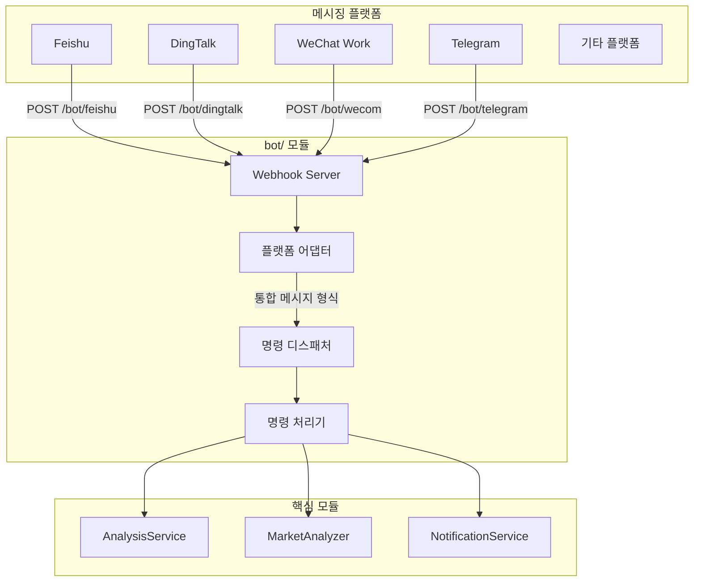

# Bot 연동 가이드

이 문서는 Bot 모듈 구조, 지원 명령, Webhook 라우트, 플랫폼 연동 설정을 설명합니다.

> 여기서 Bot은 Feishu, DingTalk, WeChat Work, Telegram 같은 메시징 플랫폼에서 Webhook으로 명령을 받고 분석 파이프라인을 호출해 답변하는 챗봇을 뜻합니다.

## 1. 구조



## 2. 디렉터리 구조

```text
bot/
├── __init__.py             # 모듈 진입점
├── models.py               # 통합 메시지/응답 모델
├── dispatcher.py           # 명령 디스패처
├── handler.py              # 플랫폼별 Webhook 처리 함수
├── commands/               # 명령 처리기
│   ├── base.py             # 명령 추상 기반 클래스
│   ├── analyze.py          # /analyze 종목 분석
│   ├── ask.py              # /ask 단일 질문
│   ├── batch.py            # /batch 관심 종목 일괄 분석
│   ├── chat.py             # /chat 다중 턴 전략 대화
│   ├── market.py           # /market 시장 복기
│   ├── help.py             # /help 도움말
│   └── status.py           # /status 시스템 상태
└── platforms/              # 플랫폼 어댑터
    ├── base.py             # 플랫폼 추상 기반 클래스
    ├── dingtalk.py         # DingTalk Bot
    ├── dingtalk_stream.py  # DingTalk Stream Bot
    └── feishu_stream.py    # Feishu/Lark Stream Bot
```

## 3. 핵심 추상화

### 3.1 통합 메시지 모델

```python
@dataclass
class BotMessage:
    platform: str       # 플랫폼 ID: feishu / dingtalk / wecom / telegram
    user_id: str        # 발신자 ID
    user_name: str      # 발신자 표시 이름
    chat_id: str        # 대화 ID
    chat_type: str      # 대화 유형: group / private
    content: str        # 메시지 본문
    raw_data: Dict      # 플랫폼 원본 요청 데이터
    timestamp: datetime
    mentioned: bool = False  # Bot 멘션 여부

@dataclass
class BotResponse:
    text: str
    markdown: bool = False
    at_user: bool = True
```

### 3.2 플랫폼 어댑터 기반 클래스

```python
class BotPlatform(ABC):
    @property
    @abstractmethod
    def platform_name(self) -> str: ...

    @abstractmethod
    def verify_request(self, headers: Dict, body: bytes) -> bool:
        """요청 서명을 검증합니다."""
        ...

    @abstractmethod
    def parse_message(self, data: Dict) -> Optional[BotMessage]:
        """플랫폼 메시지를 통합 형식으로 변환합니다."""
        ...

    @abstractmethod
    def format_response(self, response: BotResponse, message: BotMessage) -> WebhookResponse:
        """통합 응답을 플랫폼 응답 형식으로 변환합니다."""
        ...
```

### 3.3 명령 기반 클래스

```python
class BotCommand(ABC):
    @property
    @abstractmethod
    def name(self) -> str: ...

    @property
    @abstractmethod
    def aliases(self) -> List[str]: ...

    @property
    @abstractmethod
    def description(self) -> str: ...

    @property
    @abstractmethod
    def usage(self) -> str: ...

    @abstractmethod
    def execute(self, message: BotMessage, args: List[str]) -> BotResponse: ...
```

## 4. 지원 명령

| 명령 | 설명 | 예시 |
| --- | --- | --- |
| `/analyze` | 특정 종목 분석 | `/analyze AAPL`, `/analyze 600519` |
| `/ask` | 종목이나 시장에 대한 단일 질문 | `/ask AAPL RSI는?` |
| `/batch` | 설정된 관심 종목 일괄 분석 | `/batch` |
| `/chat` | 대화 맥락을 유지하는 전략 대화 | `/chat` |
| `/market` | 시장 복기 | `/market` |
| `/help` | 도움말 표시 | `/help` |
| `/status` | 시스템 상태 표시 | `/status` |

종목 코드 형식은 A주 6자리 코드, 홍콩 주식 `hk` 접두사, 미국 주식 ticker를 사용합니다.

## 5. `/status`와 LLM 설정 진단

`/status`의 AI 사용 가능성 판단은 런타임 우선순위를 따릅니다.

1. `LITELLM_CONFIG`
2. `LLM_CHANNELS`
3. legacy provider 키: `GEMINI_API_KEY`, `OPENAI_API_KEY`, `ANTHROPIC_API_KEY`, `DEEPSEEK_API_KEY`

현재 활성 계층에서 `LITELLM_MODEL` 또는 `AGENT_LITELLM_MODEL`의 provider를 사용할 수 없으면 `/status`는 AI 서비스 미설정 상태와 구체적인 사유를 표시합니다. 이 진단은 `GET /api/v1/system/config/setup/status`와 같은 기준을 사용하며, 모드 전환 시 기존 설정값을 자동 삭제하거나 마이그레이션하지 않습니다.

런타임 의존성 기준은 `requirements.txt`의 `litellm>=1.80.10,!=1.82.7,!=1.82.8,<2.0.0` 범위입니다.

## 6. Webhook 라우트

플랫폼별 처리 함수는 `bot/handler.py`에 있습니다. 일부 라우트는 FastAPI 앱에 자동 연결되어 있지 않을 수 있으므로, 필요한 경우 직접 mount해야 합니다.

| 라우트 | 메서드 | 상태 | 설명 |
| --- | --- | --- | --- |
| `/bot/dingtalk` | POST | 사용 가능 | `DingtalkPlatform`이 `ALL_PLATFORMS`에 등록됨 |
| `/bot/feishu` | POST | Stream 중심 | `feishu_stream.py` 사용 |
| `/bot/wecom` | POST | 미구현 | handler는 있으나 어댑터 없음 |
| `/bot/telegram` | POST | 미구현 | handler는 있으나 어댑터 없음 |

DingTalk Webhook을 FastAPI에 직접 연결하는 예시는 다음과 같습니다.

```python
from bot.handler import handle_dingtalk_webhook

@app.post("/bot/dingtalk")
async def dingtalk_webhook(request: Request):
    headers = dict(request.headers)
    body = await request.body()
    return handle_dingtalk_webhook(headers, body)
```

## 7. 설정

Bot 관련 설정은 `.env.example`의 Bot, Feishu, DingTalk, 알림 섹션을 기준으로 추가합니다.

```dotenv
BOT_ENABLED=false
BOT_COMMAND_PREFIX=/

DINGTALK_APP_KEY=
DINGTALK_APP_SECRET=
DINGTALK_STREAM_ENABLED=false

FEISHU_APP_ID=
FEISHU_APP_SECRET=
FEISHU_STREAM_ENABLED=false
```

외부 플랫폼 토큰과 서명 키는 저장소에 커밋하지 말고 환경 변수나 배포 환경의 secret 저장소에 둡니다.
