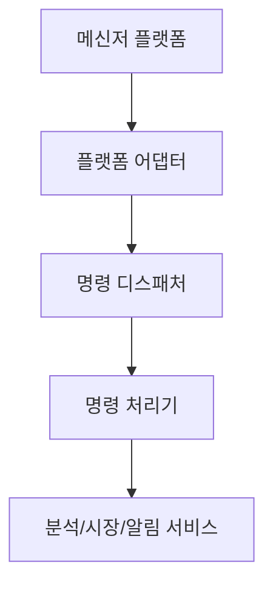

# Bot 명령 가이드

Daily Stock Analysis의 봇 모듈은 메신저에서 분석 명령을 받아 백엔드 분석 흐름을 실행합니다.

## 구조



## 기본 명령

| 명령 | 설명 |
| --- | --- |
| `/help` | 사용 가능한 명령을 표시합니다. |
| `/status` | 시스템 상태와 주요 설정 상태를 확인합니다. |
| `/analyze <code>` | 단일 종목 분석을 실행합니다. |
| `/ask <code> [question]` | Agent 기반 종목 질문을 실행합니다. |
| `/market` | 시장 리뷰를 실행합니다. |
| `/batch` | 관심 종목 목록을 일괄 분석합니다. |
| `/chat <question>` | Agent 채팅을 실행합니다. |
| `/history` | 최근 대화/분석 히스토리를 확인합니다. |
| `/strategies` | 사용 가능한 전략 목록을 확인합니다. |

## 종목 코드 예시

```text
/analyze KR005930
/analyze AAPL
/analyze HK00700
/analyze CN600519
```

## 플랫폼

지원 또는 연동 대상:

- Discord
- DingTalk
- Feishu
- Telegram
- Slack 또는 Webhook 계열 채널

플랫폼별 설정은 `docs/bot/` 하위 문서를 참고하세요.

## 설정

대표 설정 항목:

```env
AGENT_MODE=true
BOT_COMMAND_PREFIX=/
```

플랫폼별 토큰, Webhook URL, Stream 설정은 사용하는 플랫폼에 맞게 추가합니다.

## 운영 팁

- 봇 명령은 서버가 외부에서 접근 가능해야 정상 동작합니다.
- Agent 기능은 LLM 설정이 완료되어야 사용할 수 있습니다.
- 대화방에서는 멘션이 필요한 플랫폼이 있을 수 있습니다.
- 알림 채널 실패는 로그에 남기고 가능한 경우 다른 채널로 계속 진행합니다.

## 문제 해결

### 명령을 인식하지 못합니다

- 명령 접두어가 맞는지 확인합니다.
- 봇이 메시지를 받을 권한이 있는지 확인합니다.
- 플랫폼 Webhook/Stream 연결 상태를 확인합니다.

### 분석은 시작되지만 결과가 오지 않습니다

- LLM 설정과 API Key를 확인합니다.
- 백엔드 로그에서 분석 실패 원인을 확인합니다.
- 알림 채널 테스트를 먼저 실행합니다.

### 봇은 응답하지만 분석 품질이 낮습니다

- 종목 코드와 시장 접두어를 명확히 입력합니다.
- 질문을 구체적으로 작성합니다.
- 필요한 전략을 명시합니다.
