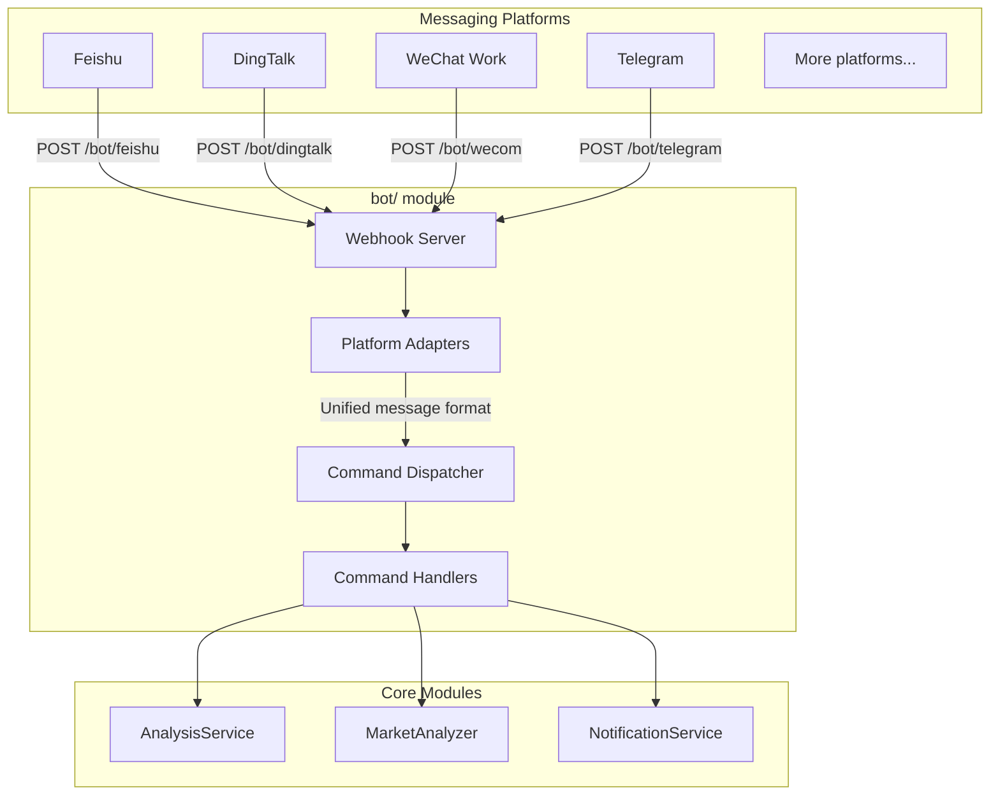

# ボット連携ガイド

本ドキュメントでは、ボットモジュールのアーキテクチャ、サポートされるコマンド、Webhook ルート、およびプラットフォーム連携の設定方法を説明します。

> **用語集:** ここでいう「エンタープライズボット」とは、メッセージングプラットフォーム（Feishu／DingTalk／WeChat Work／Telegram）から Webhook 経由でコマンドを受け取り、分析パイプラインを呼び出してインラインで返信するチャットボットを指します。

---

## 1. アーキテクチャ概要



---

## 2. ディレクトリ構成

```
bot/
├── __init__.py             # モジュールのエントリ、主要クラスをエクスポート
├── models.py               # 統一されたメッセージ／レスポンスモデル
├── dispatcher.py           # コマンドディスパッチャー（コア）
├── handler.py              # Webhook ハンドラー関数（プラットフォームごとに1つ）
├── commands/               # コマンドハンドラー
│   ├── __init__.py
│   ├── base.py             # コマンドの抽象基底クラス
│   ├── analyze.py          # /analyze — 銘柄分析
│   ├── ask.py              # /ask — 単発の質問
│   ├── batch.py            # /batch — ウォッチリストの一括分析
│   ├── chat.py             # /chat — 複数ラウンドの戦略チャット
│   ├── market.py           # /market — 大引け振り返り
│   ├── help.py             # /help — ヘルプテキスト
│   └── status.py           # /status — システムステータス
└── platforms/              # プラットフォームアダプター
    ├── __init__.py
    ├── base.py             # プラットフォームの抽象基底クラス
    ├── dingtalk.py         # DingTalk ボット
    ├── dingtalk_stream.py  # DingTalk Stream ボット
    └── feishu_stream.py    # Feishu (Lark) Stream ボット
```

---

## 3. コアとなる抽象化

### 3.1 統一メッセージモデル（`bot/models.py`）

```python
@dataclass
class BotMessage:
    platform: str       # プラットフォーム ID: feishu / dingtalk / wecom / telegram
    user_id: str        # 送信者 ID
    user_name: str      # 送信者の表示名
    chat_id: str        # 会話 ID（グループまたは DM）
    chat_type: str      # 会話タイプ: group / private
    content: str        # メッセージテキスト
    raw_data: Dict      # 生のリクエストデータ（プラットフォーム固有）
    timestamp: datetime
    mentioned: bool = False  # ボットが @メンションされたかどうか

@dataclass
class BotResponse:
    text: str
    markdown: bool = False  # レスポンスが Markdown かどうか
    at_user: bool = True    # 送信者を @メンションするかどうか
```

### 3.2 プラットフォームアダプター基底クラス（`bot/platforms/base.py`）

```python
class BotPlatform(ABC):
    @property
    @abstractmethod
    def platform_name(self) -> str: ...

    @abstractmethod
    def verify_request(self, headers: Dict, body: bytes) -> bool:
        """リクエスト署名を検証する（セキュリティチェック）"""
        ...

    @abstractmethod
    def parse_message(self, data: Dict) -> Optional[BotMessage]:
        """プラットフォームのメッセージを統一フォーマットに解析する"""
        ...

    @abstractmethod
    def format_response(self, response: BotResponse, message: BotMessage) -> WebhookResponse:
        """統一レスポンスをプラットフォーム形式に変換する"""
        ...
```

### 3.3 コマンド基底クラス（`bot/commands/base.py`）

```python
class BotCommand(ABC):
    @property
    @abstractmethod
    def name(self) -> str: ...          # 例: 'analyze'

    @property
    @abstractmethod
    def aliases(self) -> List[str]: ... # 例: ['a', 'analyse']

    @property
    @abstractmethod
    def description(self) -> str: ...

    @property
    @abstractmethod
    def usage(self) -> str: ...

    @abstractmethod
    def execute(self, message: BotMessage, args: List[str]) -> BotResponse: ...
```

---

## 4. サポートされるコマンド

| コマンド | 説明 | 例 |
|---------|-------------|---------|
| `/analyze` | 特定の銘柄を分析する | `/analyze AAPL` または `/analyze 600519` |
| `/ask` | 銘柄や市場に関する単発の質問 | `/ask what is RSI for AAPL` |
| `/batch` | 設定済みウォッチリストを一括分析する | `/batch` |
| `/chat` | 複数ラウンドの戦略チャット（会話コンテキストを保持） | `/chat` |
| `/market` | 大引け振り返り（A 株／米国株） | `/market` |
| `/help` | ヘルプテキストを表示する | `/help` |
| `/status` | システムステータスを表示する | `/status` |

> **銘柄コードの形式:** A 株は 6 桁のコードを使用（例：`600519`）。香港株は `hk` プレフィックスを付与（例：`hk00700`）。米国株はティッカーシンボルを使用（例：`AAPL`、`TSLA`）。

---

## 5. `/status` と LLM 設定の診断

### `/status` における準備状態の設定優先順位

- `/status` が表示する AI の利用可否は、ランタイムの優先順位に従います：
  - `LITELLM_CONFIG`（LiteLLM YAML）
  - `LLM_CHANNELS`
  - レガシープロバイダーキー（`GEMINI_API_KEY` / `OPENAI_API_KEY` / `ANTHROPIC_API_KEY` / `DEEPSEEK_API_KEY`）
- プライマリモデル（`LITELLM_MODEL` または `AGENT_LITELLM_MODEL`）が有効なレイヤーで設定済みのソースを持たない場合、`/status` は `AI 服务未配置` を表示し、明示的な理由行を維持します。
- 本リポジトリのランタイム依存制約は `litellm>=1.80.10,!=1.82.7,!=1.82.8,<2.0.0` です。現在のステータスセマンティクスはこの制約に整合しています。
- この診断は、LLM チェックについて `GET /api/v1/system/config/setup/status` と同じ準備状態ルールに従います：channels/yaml はレガシーキーより高い優先順位で有効になり、モード切り替え時に暗黙的な移行は行われません。

### フォールバックと移行の境界

- `LITELLM_CONFIG` または `LLM_CHANNELS` が有効な場合、優先順位の低いレガシープロバイダーキーは、その実行における有効なソースとしては無視されます（暗黙的なダウングレードはありません）。
- この変更は診断を改善するのみで、自動移行は行いません：レガシー設定値は、起動時やステータス収集時に削除・書き換えされることはありません。

### 公式互換性リファレンス（トリアージ用）

- LiteLLM ドキュメント: https://docs.litellm.ai/
- LiteLLM OpenAI 互換プロバイダー: https://docs.litellm.ai/docs/providers/openai_compatible
- OpenAI Chat API: https://platform.openai.com/docs/api-reference/chat
- DeepSeek API ドキュメント: https://api-docs.deepseek.com/
- Kimi Moonshot 互換性: https://platform.moonshot.ai/docs/guide/compatibility
- Gemini OpenAI 互換性: https://ai.google.dev/gemini-api/docs/openai
- Ollama API ドキュメント: https://github.com/ollama/ollama/blob/main/docs/api.md

## 6. Webhook ルート

各プラットフォームのハンドラー関数は `bot/handler.py` にあります。
これらのルートは FastAPI アプリケーションに**まだ組み込まれていません** — 手動でマウントする必要があります。

| ルート | メソッド | ステータス | 備考 |
|-------|--------|--------|-------|
| `/bot/dingtalk` | POST | **対応済み** | `DingtalkPlatform` が `ALL_PLATFORMS` に登録済み |
| `/bot/feishu` | POST | Stream のみ | `feishu_stream.py` を使用。`ALL_PLATFORMS` に Webhook アダプターなし |
| `/bot/wecom` | POST | 未実装 | ハンドラーは存在するがプラットフォームアダプターなし |
| `/bot/telegram` | POST | 未実装 | ハンドラーは存在するがプラットフォームアダプターなし |

FastAPI アプリで DingTalk の Webhook をマウントするには：

```python
from bot.handler import handle_dingtalk_webhook

@app.post("/bot/dingtalk")
async def dingtalk_webhook(request: Request):
    headers = dict(request.headers)
    body = await request.body()
    return handle_dingtalk_webhook(headers, body)
```

---

## 7. 設定

`.env` に以下を追加してください。これらのボット固有のキーの一部はすでに `.env.example` に記載されています（例えば DingTalk と Feishu のアプリ認証情報）が、記載されていないものもあります。そのため、本セクションはボットセットアップの統合リファレンスとして扱ってください：

```dotenv
# --- ボット全般 ---
BOT_ENABLED=false
BOT_COMMAND_PREFIX=/

# --- Feishu (Lark) ボット ---
FEISHU_APP_ID=
FEISHU_APP_SECRET=
FEISHU_VERIFICATION_TOKEN=    # イベント検証トークン
FEISHU_ENCRYPT_KEY=           # 暗号化キー（オプション）

# --- DingTalk ボット ---
DINGTALK_APP_KEY=
DINGTALK_APP_SECRET=

# --- WeChat Work ボット（開発中） ---
WECOM_TOKEN=
WECOM_ENCODING_AES_KEY=

# --- Telegram ボット ---
TELEGRAM_BOT_TOKEN=           # @BotFather から取得
TELEGRAM_WEBHOOK_SECRET=      # Webhook シークレットトークン
```

---

## 7. ボットの拡張

### 新しいプラットフォームアダプターの追加

1. `bot/platforms/` に新しいファイルを作成します。
2. `BotPlatform` をサブクラス化し、`verify_request`、`parse_message`、`format_response` を実装します。
3. Webhook ルートを `api/v1/router.py` ではなく FastAPI アプリ（例えば `api/app.py`）に直接マウントします。これにより、コールバックパスは `/api/v1/bot/<platform>` ではなく `/bot/<platform>` のままになります。

### 新しいコマンドの追加

1. `bot/commands/` に新しいファイルを作成します。
2. `BotCommand` をサブクラス化し、`execute` メソッドを実装します。
3. ディスパッチャーの起動コードでコマンドを登録します。
