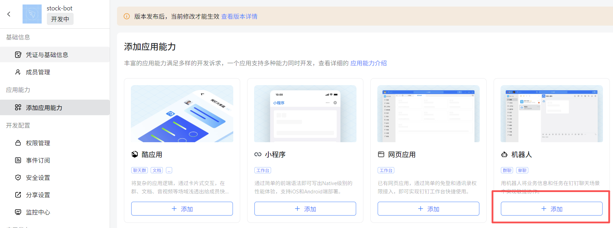
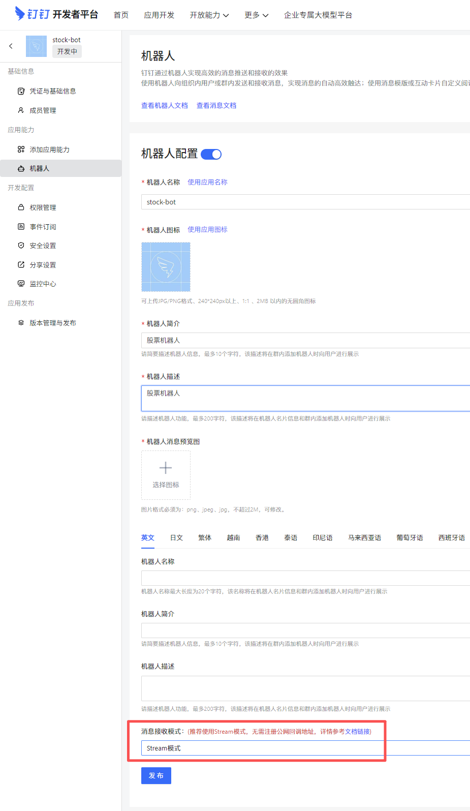
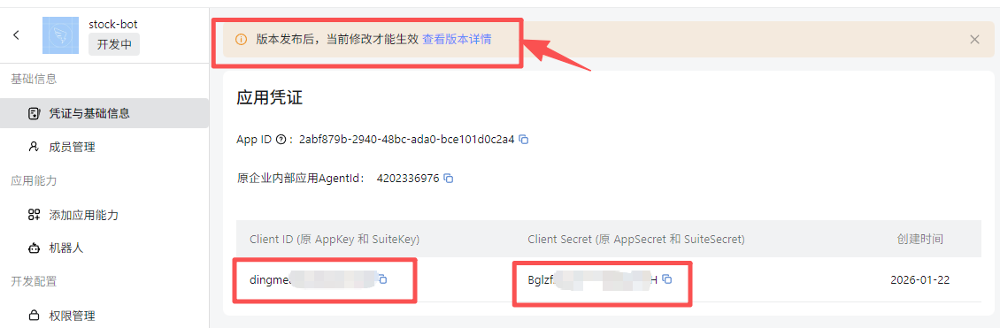
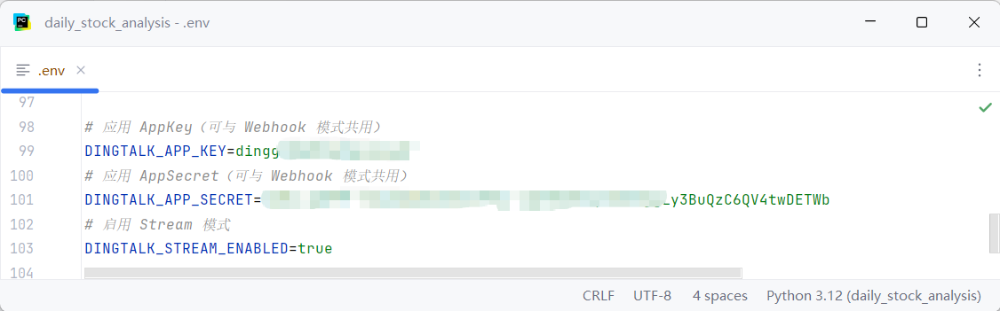
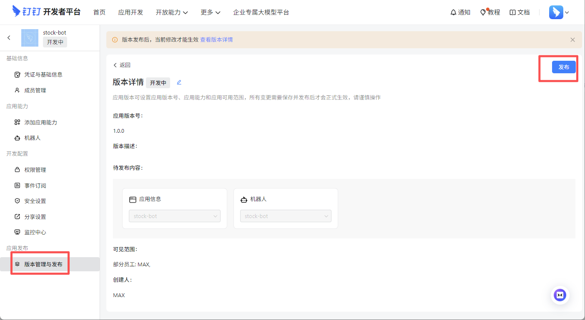
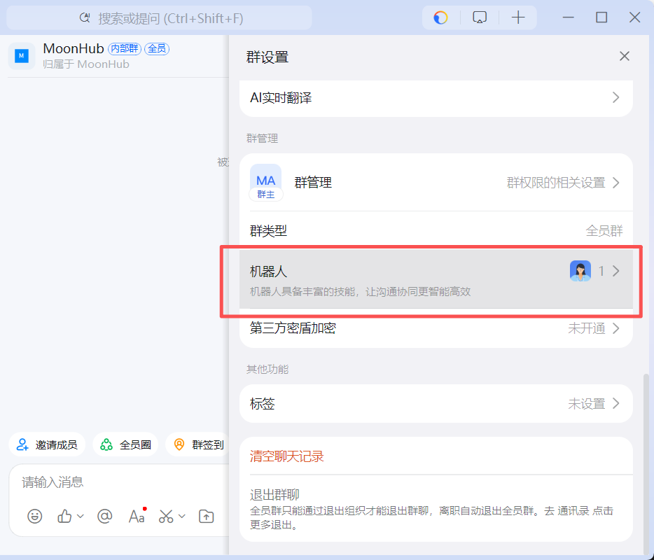
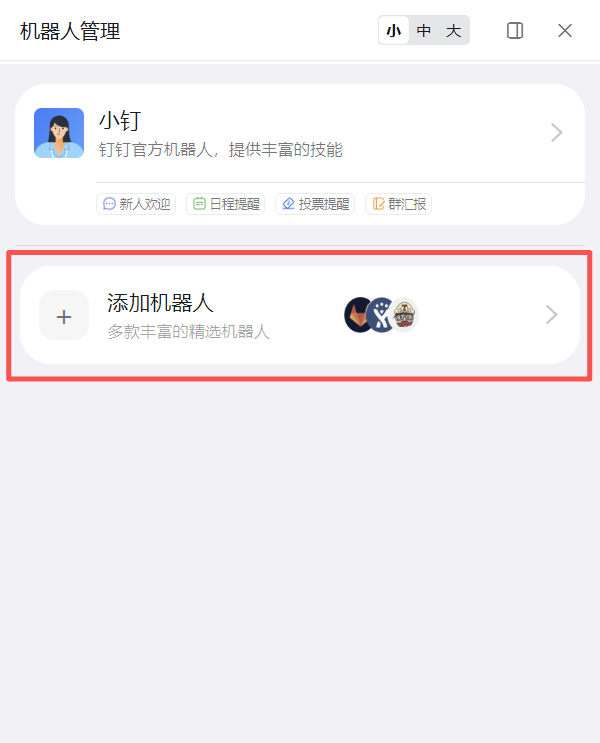
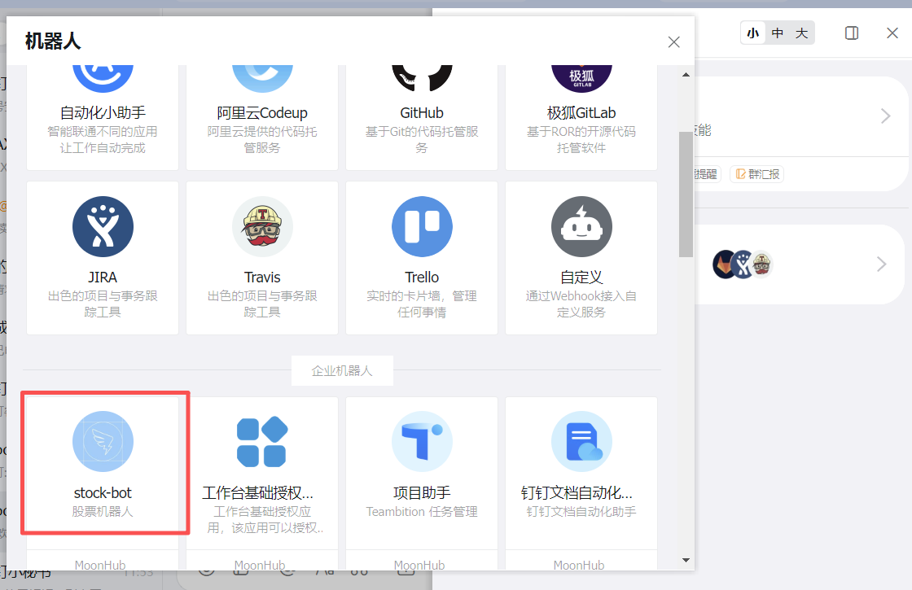
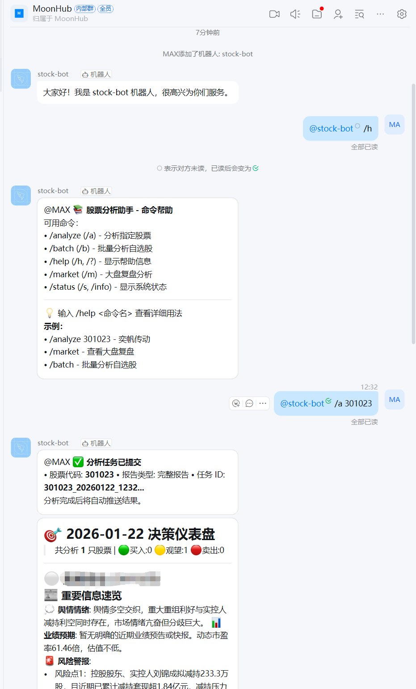

# DingTalk Bot 설정 가이드

이 문서는 DingTalk으로 분석 결과를 보내기 위한 Bot 설정 방법을 설명합니다. DingTalk Open Platform의 화면 구성은 바뀔 수 있으므로, 세부 메뉴 이름은 공식 문서를 함께 확인하세요.

공식 문서:

- [Robot Application 구성](https://open.dingtalk.com/document/dingstart/configure-the-robot-application)
- [Application 생성](https://open.dingtalk.com/document/dingstart/create-application)

## 권장 모드

DingTalk Bot은 여러 연결 방식을 제공할 수 있습니다. 이 프로젝트에서는 일반 알림 전송 목적이라면 Stream 모드 또는 프로젝트에서 지원하는 Bot 연결 방식을 사용합니다. 단순 Webhook과 Stream Bot의 설정값을 섞어 쓰지 않도록 주의하세요.

## 애플리케이션 만들기

1. DingTalk Open Platform에 로그인합니다.
2. 애플리케이션 관리 화면으로 이동합니다.
3. 새 애플리케이션을 만듭니다.
4. Bot 기능을 추가합니다.

참고 화면:



## Bot 연결 방식 설정

Bot 설정 화면에서 프로젝트가 요구하는 연결 방식을 선택합니다. Stream 모드를 사용할 경우 DingTalk 콘솔에서 Stream 관련 옵션을 활성화합니다.



## App Key와 Secret 확인

애플리케이션 상세 화면에서 App Key와 App Secret을 확인합니다. 이 값은 `.env` 설정에 사용합니다.



## 환경 변수 설정

프로젝트 루트의 `.env`에 DingTalk 설정을 추가합니다. 실제 변수명은 현재 코드와 `.env.example`을 기준으로 확인하세요.

```env
DINGTALK_APP_KEY=your_app_key
DINGTALK_APP_SECRET=your_app_secret
DINGTALK_STREAM_ENABLED=true
```

환경 변수 입력 예시는 다음 화면을 참고합니다.



## 애플리케이션 게시

DingTalk 콘솔에서 애플리케이션을 게시하고 사용할 조직 또는 그룹에 연결합니다.



## 그룹에 Bot 추가

분석 결과를 받을 DingTalk 그룹에 Bot을 추가합니다.





## 권한과 보안 설정

Bot이 메시지를 보낼 그룹에 포함되어 있는지, 조직 보안 정책이나 IP 제한에 막히지 않는지 확인합니다.



## 테스트

앱 또는 서버를 실행한 뒤 알림 테스트 기능을 사용하거나 분석 작업을 실행해 DingTalk 메시지가 도착하는지 확인합니다.



## 문제 해결

### 메시지가 오지 않습니다.

- App Key와 App Secret이 올바른지 확인합니다.
- Bot이 대상 그룹에 추가되어 있는지 확인합니다.
- DingTalk 콘솔에서 Bot 또는 애플리케이션이 게시 완료 상태인지 확인합니다.
- IP 제한, 조직 보안 정책, 권한 설정을 확인합니다.

### 설정값을 바꿨는데 반영되지 않습니다.

`.env`를 수정한 뒤에는 앱 또는 서버 프로세스를 재시작합니다. 데스크톱 앱에서 설정을 바꾼 경우 저장 성공 메시지를 확인한 뒤 다시 테스트합니다.
