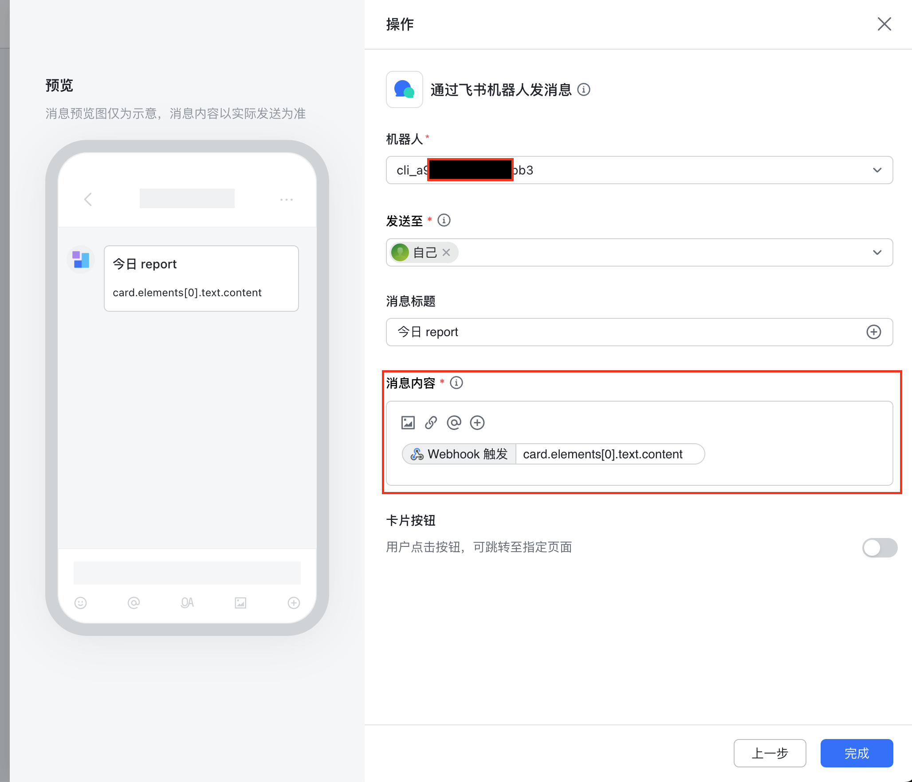
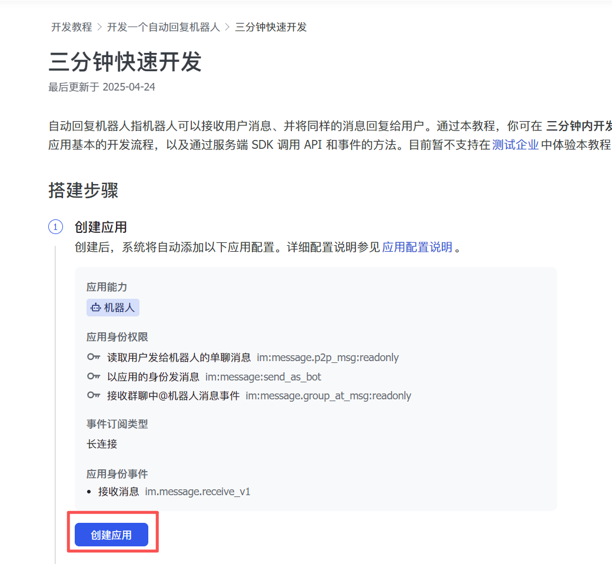
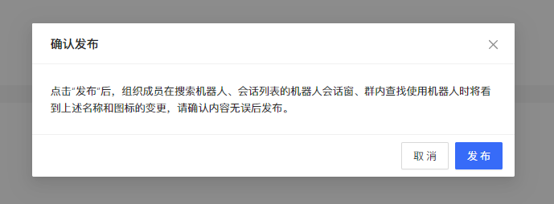

# Feishu 알림 설정 가이드

이 문서는 Feishu로 분석 결과를 보내는 방법을 설명합니다. 먼저 사용할 모드를 명확히 나누는 것이 중요합니다.

1. 그룹 Webhook Bot: 분석 보고서를 Feishu 그룹으로 보내는 가장 간단한 방식
2. Feishu 애플리케이션 / Stream Bot / 클라우드 문서: Feishu 앱 상호작용이나 고급 기능이 필요한 방식

일반적인 알림 전송만 필요하다면 그룹 Webhook Bot을 권장합니다.

## 모드 구분

### 그룹 Webhook Bot

적합한 경우:

- 분석 결과를 Feishu 그룹으로 보내고 싶습니다.
- Feishu 메시지 콜백을 처리할 필요가 없습니다.
- Stream Bot이나 클라우드 문서 기능이 필요하지 않습니다.

필요한 설정:

```env
FEISHU_WEBHOOK_URL=https://open.feishu.cn/open-apis/bot/v2/hook/your_hook_token

# 선택 사항
FEISHU_WEBHOOK_SECRET=your_sign_secret
FEISHU_WEBHOOK_KEYWORD=주식일보
```

### Feishu 애플리케이션 / Stream Bot / 클라우드 문서

적합한 경우:

- Feishu 앱 Bot과 상호작용해야 합니다.
- Stream 연결을 사용해야 합니다.
- Feishu 클라우드 문서 기능을 사용해야 합니다.

관련 설정:

```env
FEISHU_APP_ID=cli_xxx
FEISHU_APP_SECRET=xxx
FEISHU_STREAM_ENABLED=true
```

주의:

- `FEISHU_APP_ID`와 `FEISHU_APP_SECRET`만으로는 그룹 Webhook 알림이 켜지지 않습니다.
- 알림만 받고 싶다면 `FEISHU_WEBHOOK_URL`을 우선 설정하세요.
- 애플리케이션 Bot 또는 Stream Bot을 구성하는 경우에는 Feishu 개발자 콘솔의 별도 절차가 필요합니다.

## 그룹 Webhook Bot 설정

### 1. Feishu 그룹에서 사용자 지정 Bot 생성

일반적인 경로:

1. 대상 그룹 채팅을 엽니다.
2. 그룹 설정으로 이동합니다.
3. 그룹 Bot 또는 Bot 관리 메뉴를 엽니다.
4. 사용자 지정 Bot을 추가합니다.
5. 생성된 Webhook URL을 복사합니다.

예시:

```env
FEISHU_WEBHOOK_URL=https://open.feishu.cn/open-apis/bot/v2/hook/xxxxxxxx-xxxx-xxxx-xxxx-xxxxxxxxxxxx
```

### 2. 보안 설정 확인

Feishu 그룹 Bot은 보통 다음 보안 옵션을 제공합니다.

1. 보안 제한 없음
2. 키워드 검증
3. 서명 검증

Bot에 보안 옵션을 켰다면 프로젝트 설정에도 같은 값을 넣어야 합니다.

#### 키워드 검증

Feishu에서 설정한 키워드를 `.env`에 추가합니다.

```env
FEISHU_WEBHOOK_KEYWORD=주식일보
```

프로젝트는 메시지에 해당 키워드를 포함해 전송합니다.

#### 서명 검증

Feishu에서 표시한 secret을 `.env`에 추가합니다.

```env
FEISHU_WEBHOOK_SECRET=your_sign_secret
```

프로젝트는 Feishu 요구 형식에 맞춰 `timestamp`와 `sign`을 함께 보냅니다.

### 3. 실행과 검증

`FEISHU_WEBHOOK_URL`이 설정되어 있으면 알림 전송은 Webhook 경로를 사용합니다.

`FEISHU_APP_ID`와 `FEISHU_APP_SECRET`을 함께 설정해도 Webhook 전송 자체를 대체하지 않습니다. 두 값은 애플리케이션 모드에서 쓰이는 값입니다.

## Feishu 자동화 Webhook 트리거

Feishu 자동화에서 이 프로젝트가 보내는 카드 메시지를 소비한다면 Webhook 트리거에 다음 구조를 참고해 설정합니다.

```json
{
  "msg_type": "interactive",
  "card": {
    "config": { "wide_screen_mode": true },
    "elements": [
      {
        "tag": "div",
        "text": {
          "tag": "lark_md",
          "content": "..."
        }
      }
    ],
    "header": {
      "title": {
        "tag": "plain_text",
        "content": "주식 분석 보고서"
      }
    }
  }
}
```

자동화의 메시지 내용 매핑에서는 카드 본문을 `card.elements[0].text.content`에 연결합니다.



## 자주 발생하는 문제

### `FEISHU_APP_ID`와 `FEISHU_APP_SECRET`만 설정했습니다.

증상:

- Feishu 설정을 했다고 생각하지만 그룹 알림이 오지 않습니다.

원인:

- 이 값들은 애플리케이션 모드용이며 그룹 Webhook URL이 아닙니다.

해결:

- `FEISHU_WEBHOOK_URL`을 추가합니다.

### Bot에 키워드 검증이 켜져 있습니다.

증상:

- 다른 앱은 전송되지만 이 프로젝트 메시지는 거부됩니다.

해결:

- Feishu Bot 보안 설정의 키워드를 `FEISHU_WEBHOOK_KEYWORD`에 그대로 넣습니다.

### Bot에 서명 검증이 켜져 있습니다.

증상:

- Webhook URL은 맞지만 서명 관련 오류가 발생합니다.

해결:

- Feishu Bot에서 표시하는 secret을 `FEISHU_WEBHOOK_SECRET`에 넣습니다.

### Bot이 대상 그룹에 없습니다.

확인:

- Bot이 실제 대상 그룹에 추가되어 있는지 확인합니다.
- 그룹 관리자가 Bot 발언을 제한하지 않았는지 확인합니다.

### IP 화이트리스트가 켜져 있습니다.

클라우드 서버, Docker, GitHub Actions에서 실행하면 외부로 나가는 IP가 로컬과 다를 수 있습니다.

확인:

- Feishu Bot에 IP 화이트리스트가 설정되어 있는지 확인합니다.
- 현재 실행 환경의 outbound IP가 화이트리스트에 포함되어 있는지 확인합니다.

## 최소 설정 예시

### 보안 제한 없음

```env
FEISHU_WEBHOOK_URL=https://open.feishu.cn/open-apis/bot/v2/hook/your_hook_token
```

### 키워드 검증

```env
FEISHU_WEBHOOK_URL=https://open.feishu.cn/open-apis/bot/v2/hook/your_hook_token
FEISHU_WEBHOOK_KEYWORD=주식일보
```

### 서명 검증

```env
FEISHU_WEBHOOK_URL=https://open.feishu.cn/open-apis/bot/v2/hook/your_hook_token
FEISHU_WEBHOOK_SECRET=your_sign_secret
```

### 키워드와 서명 모두 사용

```env
FEISHU_WEBHOOK_URL=https://open.feishu.cn/open-apis/bot/v2/hook/your_hook_token
FEISHU_WEBHOOK_SECRET=your_sign_secret
FEISHU_WEBHOOK_KEYWORD=주식일보
```

## 점검 순서

1. 원하는 방식이 그룹 Webhook인지, 애플리케이션/Stream Bot인지 먼저 정합니다.
2. 그룹 알림만 필요하면 `FEISHU_WEBHOOK_URL`을 설정합니다.
3. Feishu Bot 보안 설정에서 키워드 또는 서명을 켰는지 확인합니다.
4. 켰다면 `FEISHU_WEBHOOK_KEYWORD` 또는 `FEISHU_WEBHOOK_SECRET`을 추가합니다.
5. Bot이 그룹에 있고 발언 권한이 있으며 IP 제한에 걸리지 않는지 확인합니다.

## 애플리케이션 / Stream Bot 참고

그룹 Webhook이 아니라 Feishu 애플리케이션, 장기 연결 Bot, 클라우드 문서 기능을 구성해야 한다면 Feishu 공식 문서를 기준으로 진행하세요.

참고:

<https://open.feishu.cn/document/develop-an-echo-bot/introduction>

화면 흐름 참고:







